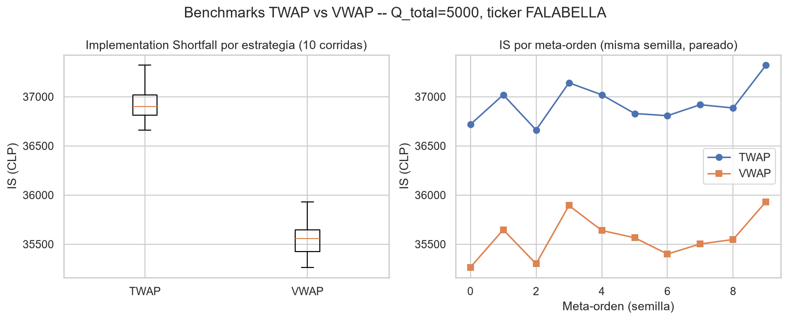

# Benchmarks TWAP y VWAP (tarea 2.3.4, Sprint 5) — adelantada

**Autor:** Paolo Sepúlveda (PS) — 1 octubre 2026
**Estado:** Adelantada desde el Sprint 4 (termina el Sprint 5 oficialmente el 23 de octubre), mientras se espera que Mauricio y Benjamín avancen sus tareas pendientes del Sprint 4. No depende de sus redes PPO ni de la calibración de `rmsc04`.

---

## 1. Qué pide la tarea (plan oficial)

> "Implementar TWAP (divide por tiempo) y VWAP (divide por volumen). Ejecutar en 10 meta-órdenes, medir IS de cada uno."

Y el Título I (sección 4.1.4, citado textual):

> **TWAP:** "Distribuye el volumen total de la orden en partes iguales a lo largo del tiempo, ejecutando Q/T acciones en cada periodo... completamente 'ciego' a las condiciones de liquidez."
>
> **VWAP:** "Intenta replicar el perfil histórico de volumen del mercado, enviando órdenes mayores en los períodos de mayor actividad histórica."

## 2. Decisión de diseño — por qué esto corre fuera de `MaestroEjecutorEnv`

El espacio de acción discreto del Maestro (`MaestroDiscreteActionSpace`, 10 fracciones entre 0.05 y 0.50) está diseñado para la red PPO, no para reglas analíticas. Forzar TWAP/VWAP a pasar por esas 10 fracciones introduciría un error de discretización ajeno a la definición clásica (que usa fracciones continuas de `Q/T`). Por eso se construyó un runner independiente (`src/analysis/benchmarks.py`) que:

- Reutiliza el **mismo Ejecutor real** (`EjecutorEnvPoissonFallback`, dinámica Poisson calibrada con datos del IPSA) y las **mismas métricas** (`execution_metrics.py`) que usará el sistema PPO — comparación de manzanas con manzanas cuando ese sistema exista.
- Usa una política de ejecución **"ingenua"** dentro de cada periodo (siempre orden de MERCADO, todo el volumen asignado de una vez) — consistente con que TWAP/VWAP son, según el Título I, reglas simples sin táctica de microejecución. Esto no es la política de Mauricio (2.2.1/2.3.1), es intencionalmente más simple.

## 3. Implementación

- `twap_schedule(q_total)`: reparte `Q_total` en 13 partes iguales (una por cada decisión de 30 min de la jornada 09:30–16:00) — literal `Q/T`.
- `vwap_schedule(q_total, volume_profile)`: reparte `Q_total` proporcional al **volumen histórico real del IPSA por tramo** (reutiliza `volume_profile_by_session()` de `market_validation.py`, ya calculada sobre 30 tickers reales — no se inventan pesos).
- `run_benchmark_episode(schedule, seed)`: corre una jornada completa contra `EjecutorEnvPoissonFallback`, un entorno nuevo por periodo (mismo patrón que usa `MaestroEjecutorEnv._run_executor_episode()`).
- `run_benchmark_suite()`: corre TWAP y VWAP sobre 10 meta-órdenes (misma `Q_total=5000`, 10 semillas distintas — 10 realizaciones de mercado distintas, para que la comparación sea pareada 1-a-1).

## 4. Resultado (datos reales, no sintéticos)

Ticker FALABELLA, `Q_total=5000`, 10 corridas por estrategia:

| Estrategia | IS medio (CLP) | Desviación estándar |
|---|---|---|
| TWAP | 36.932 | 189 |
| VWAP | 35.569 | 211 |

**VWAP tuvo, en promedio, menor costo (IS) que TWAP** — consistente con la intuición de la literatura (seguir el volumen real reduce el impacto de mercado respecto a repartir a ciegas). La magnitud de la diferencia (~3.8%) es menor que el 10% que el Título I plantea como meta para el sistema PPO frente a estos benchmarks — es decir, VWAP ya es un benchmark más exigente que TWAP, y es contra el que el sistema propuesto tendrá que demostrar una mejora real en el Sprint 7.

## 5. Comparación estadística (extensión de la tarea 3.2.3, adelantada)

`compare_strategies()` (hecha en Sprint 4) solo cubre 2 muestras **independientes**. Aquí TWAP y VWAP se evaluaron sobre las **mismas 10 semillas** (pareado), así que se agregaron a `execution_metrics.py`:

- `compare_paired()` — Wilcoxon signed-rank (pedido explícito de 3.2.3) + Cohen's d pareado.
- `compare_groups_kruskal()` — Kruskal-Wallis para 3+ grupos (cuando exista el sistema PPO, se podrá comparar PPO vs TWAP vs VWAP de una sola vez), con post-hoc pareado (Mann-Whitney + corrección de Bonferroni) si el resultado es significativo.

**Resultado real (TWAP vs VWAP, pareado):**

| Métrica | Valor |
|---|---|
| Test | Wilcoxon signed-rank |
| p-value | 0.00195 |
| Significativo (α=0.05) | Sí |
| Cohen's d | -21.1 (convención: negativo = TWAP peor que VWAP) |

La diferencia es estadísticamente significativa, con un tamaño de efecto muy grande — pero esto se explica porque el simulador de Poisson (fallback temporal, no ABIDES real) tiene muy poca varianza entre corridas (std ~200 CLP frente a una diferencia de medias de ~1.360 CLP). Al repetir esta comparación con ABIDES real (más ruido de mercado), es esperable que el tamaño de efecto sea menor, aunque la dirección (VWAP mejor que TWAP) debería mantenerse.

## 6. Limitaciones, para no maquillar el resultado

- Corrido contra el **simulador de Poisson** (reemplazo temporal), no contra ABIDES-Gym real — los números absolutos de IS no son comparables todavía con jornadas reales del IPSA. Repetir con `EjecutorEnvAbides` cuando se quiera un número final para la tesis.
- Las 10 "meta-órdenes" son 10 semillas distintas de un mismo tamaño de orden (`Q_total=5000`), no 10 órdenes de tamaños/condiciones distintas — eso es justo la tarea 2.3.3 de Benjamín (meta-órdenes de prueba "oficiales"); cuando las entregue, se vuelve a correr este mismo código con esas órdenes en vez de las de ejemplo.
- La política de ejecución "ingenua" (solo MERCADO) es una simplificación razonable para un benchmark clásico, pero un TWAP/VWAP "profesional" real podría usar órdenes límite también — no se modeló por ser fuera del alcance de la tarea.

## 7. Archivos generados

- `src/analysis/benchmarks.py` — TWAP/VWAP + runner.
- `src/analysis/execution_metrics.py` — `compare_paired()`, `compare_groups_kruskal()`, `cohens_d_paired()` (extensión, no reemplaza lo de Sprint 4).
- `tests/test_benchmarks.py`, `tests/test_execution_metrics_stats.py` — 11 tests nuevos, todos con datos reales o casos de control conocidos (no solo mocks).
- `data/analysis/benchmarks_twap_vwap.json` / `.png` — resultado real de la corrida.
