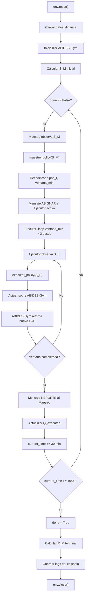

# Arquitectura del Entorno de Simulación

**Proyecto:** Coordinación de Agentes para la Mitigación del Slippage (IPSA) — Título II, UTEM
**Tarea:** 1.2.5 — Sprint 2 (31 ago – 11 sep 2026)
**Autor:** Paolo Sepúlveda Parraguez (PS)
**Fecha:** 29 agosto 2026
**Estado:** Especificación para implementación en Sprint 3 (responsable: Mauricio Reynoso, MR)

**Referencias normativas de este documento:**
- [`docs/schemas/SM_schema.json`](schemas/SM_schema.json) — vector de estado del Agente Maestro (7 variables)
- [`docs/schemas/SE_schema.json`](schemas/SE_schema.json) — vector de estado de los Agentes Ejecutores (26 variables)
- `Contexto_Agente_Programacion.md`, secciones 3, 4 y 5 (definición de MDP_M y MDP_E)

Este documento **no describe código ya construido**: especifica, antes de Sprint 3, cómo deben interactuar el Agente Maestro, los Agentes Ejecutores y ABIDES-Gym, de modo que Mauricio pueda implementar la clase de entorno sin ambigüedades. Todo lo que aquí se fija (rangos, fórmulas, formatos de mensaje) es un contrato acordado con el equipo, no una decisión unilateral: cualquier cambio a S_M/S_E debe pasar primero por los esquemas versionados en `docs/schemas/`.

---

## 1. Visión General

El sistema se organiza en 3 capas, coherentes con la arquitectura jerárquica definida en el Título I (sección 4.2):

```
┌───────────────────────────────────────────────┐
│  CAPA 1 — COORDINACIÓN (Agente Maestro)        │
│  observa S_M (7 vars) · decide cada 30 min     │
├───────────────────────────────────────────────┤
│  CAPA 2 — EJECUCIÓN (3 Agentes Ejecutores)     │
│  Apertura | Media jornada | Cierre             │
│  observan S_E (26 vars) · actúan cada 30 seg   │
├───────────────────────────────────────────────┤
│  CAPA 3 — SIMULACIÓN (ABIDES-Gym)              │
│  simula el LOB · provee Nivel 2 y ejecuciones  │
└───────────────────────────────────────────────┘
```

- **Capa de Coordinación (Maestro):** observa el estado global del mercado y del inventario, decide cada 30 minutos qué fracción de la meta-orden ejecutar (`alpha_t`) y en qué ventana (`ventana_min`).
- **Capa de Ejecución (Ejecutores):** reciben la asignación del tramo activo, deciden cada 30 segundos el tipo de orden, volumen y nivel de precio, e interactúan directamente con ABIDES-Gym.
- **Capa de Simulación (ABIDES-Gym):** simula la microestructura del LOB (configuración RMSC04) y devuelve, en cada paso, el estado observable que compone gran parte de S_E.

### Ciclo de vida de un episodio (una jornada bursátil, 09:30–16:00)

1. **Inicialización (`reset`)**: se cargan datos históricos (yfinance) y se inicializa ABIDES-Gym; se calcula `S_M` inicial.
2. **Loop principal (`step`)**: el Maestro decide → asigna al Ejecutor del tramo activo → el Ejecutor opera en su ventana interactuando con ABIDES-Gym → reporta al Maestro → se repite hasta el cierre (16:00).
3. **Finalización (`close`)**: se calcula la recompensa terminal `R_M`, se guardan los logs del episodio y se libera ABIDES-Gym.

---

## 2. Ciclo de Simulación — reset / step / close

### 2.1 Método `reset()`

**Responsable:** el entorno (`MaestroEjecutorEnv`, ver sección 7 / `src/envs/maestro_ejecutor_protocol.py`).

**Entrada:**
- `meta_orden_quantity` (`int`): `Q_total`, cantidad total de acciones a comprar (ej. 10.000).
- `datos_historicos` (`pd.DataFrame`): OHLCV de yfinance ya limpio (salida de la tarea 1.2.1 de Benjamin), indexado por timestamp, resolución 5 min, horario 09:30–16:00 hora Chile.
- `abides_config` (`dict`): configuración RMSC04 para ABIDES-Gym (salida de la tarea 1.2.3/1.2.4 de Mauricio).

**Proceso (orden obligatorio):**
1. Fijar `current_time = 09:30` (primer timestamp de `datos_historicos`).
2. Inicializar ABIDES-Gym con `abides_config`; obtener el LOB inicial.
3. Resetear contadores internos: `Q_executed = 0`, `decision_count = 0`, `executor_reports = []`.
4. Calcular `S_M` inicial (ver fórmulas en sección 4.1).
5. Retornar `s_m_initial`.

**Salida:** `s_m_initial` — `np.ndarray` de forma `(7,)`, `dtype=float32`, dentro de los rangos definidos en `SM_schema.json`.

**Tiempo de simulación en este punto:** `T = 0` (09:30).

### 2.2 Método `step(action_maestro)` — ciclo principal

Es un loop que se repite cada 30 minutos, hasta un máximo de 13 decisiones (390 min / 30 min):

| Fase | Quién actúa | Qué hace |
|---|---|---|
| A | Maestro | Observa `S_M` actual (ya calculado por `reset()` o por la iteración anterior). |
| B | Maestro | Ejecuta su política `maestro_policy(S_M)` → obtiene `action_maestro = (alpha_idx, ventana_idx)`. |
| C | Entorno | Decodifica `alpha_idx → alpha_t ∈ {0.05,...,0.50}` y `ventana_idx → ventana_min ∈ {1,5,10,15}`; calcula `q_slice = alpha_t × (Q_total - Q_executed)`. |
| D | Entorno | Construye el mensaje **ASIGNAR** (formato en sección 3.1) y lo entrega al Ejecutor cuyo tramo horario coincide con `current_time`. |
| E | Ejecutor | Ejecuta un sub-loop de `ventana_min × 2` pasos (cada paso = 30 seg): observa `S_E`, decide `(tipo_orden, volumen_frac, nivel_precio)`, actúa sobre ABIDES-Gym, acumula cantidad y precio ejecutados. |
| F | Ejecutor | Al terminar la ventana, construye el mensaje **REPORTE** (formato en sección 3.2) y lo entrega al Maestro. |
| G | Entorno | Actualiza `Q_executed += q_ejecutado`; agrega el reporte a `executor_reports`; avanza `current_time += 30 min`; incrementa `decision_count`. |
| H | Entorno | Recalcula `S_M` (`s_m_next`). |
| I | Entorno | Evalúa `done = (current_time >= 16:00)`. Si `done`, calcula `R_M` terminal (sección 4.1); si no, `r_m = 0.0` (recompensa dispersa/sparse). |

**Retorno:** `(s_m_next, r_m, done, info)`, siguiendo la convención estándar de Gymnasium, donde `info` incluye al menos `decision_count`, `Q_executed` y el último `executor_report`.

**Invariante:** cada iteración de `step()` corresponde exactamente a 30 minutos de tiempo simulado, independiente de la ventana que haya elegido el Maestro para el Ejecutor (una ventana de 1, 5 o 10 minutos dentro de esos 30 min deja tiempo sin operar, lo cual es una decisión válida del Maestro reflejada en `alpha_t`/`ventana_min`).

### 2.3 Método `close()`

1. Calcular la recompensa terminal `R_M` (si no se calculó ya en el último `step()`).
2. Persistir los logs del episodio (estructura en sección 5).
3. Cerrar/liberar el entorno ABIDES-Gym.

---

## 3. Interfaz Maestro ↔ Ejecutor

La comunicación entre el Maestro y el Ejecutor activo se modela como dos mensajes con forma de diccionario/JSON. Esto **no implica** que en Sprint 3 deban implementarse como microservicios o colas reales — dentro de un mismo proceso Python basta con pasar estos diccionarios como argumentos/retornos de método —, pero fijar el formato evita ambigüedad sobre qué campos existen y qué significan.

### 3.1 Mensaje `ASIGNAR` (Maestro → Ejecutor activo)

**Cuándo se envía:** inmediatamente después de que el Maestro decide (cada 30 min, fase B-D del ciclo `step`).

**Formato:**
```json
{
  "tipo": "asignar",
  "timestamp_inicio": "2026-09-01T09:30:00-04:00",
  "q_slice": 750.0,
  "ventana_min": 10
}
```

| Campo | Tipo | Descripción |
|---|---|---|
| `tipo` | `str` | Constante `"asignar"`. |
| `timestamp_inicio` | `datetime` (ISO 8601, TZ America/Santiago) | Instante en que comienza la ventana asignada. |
| `q_slice` | `float` | Cantidad de acciones (no fracción) asignadas a este tramo: `alpha_t × (Q_total - Q_executed)`. |
| `ventana_min` | `int` | Duración de la ventana en minutos, uno de `{1, 5, 10, 15}` (dimensión 1 de `A_M`, ver `SM_schema.json`). |

**Recibido por:** el Ejecutor cuyo tramo horario coincide con `timestamp_inicio` (Apertura 09:30–11:30, Media jornada 11:30–14:00, o Cierre 14:00–16:00).

### 3.2 Mensaje `REPORTE` (Ejecutor → Maestro)

**Cuándo se envía:** al finalizar la ventana asignada (fase F del ciclo `step`), ya sea porque se cumplió `ventana_min` o porque el Ejecutor agotó el `q_slice` antes de tiempo.

**Formato:**
```json
{
  "tipo": "reporte",
  "timestamp_fin": "2026-09-01T09:40:00-04:00",
  "q_ejecutado": 730.0,
  "p_promedio": 5804.5,
  "slippage_parcial": 3285000.0,
  "razon_termino": "ventana_completada"
}
```

| Campo | Tipo | Descripción |
|---|---|---|
| `tipo` | `str` | Constante `"reporte"`. |
| `timestamp_fin` | `datetime` | Instante en que terminó la ventana. |
| `q_ejecutado` | `float` | Cantidad de acciones realmente ejecutadas (puede ser menor a `q_slice` si no hubo liquidez suficiente). |
| `p_promedio` | `float` | Precio promedio ponderado por volumen de las transacciones realizadas en la ventana. Si `q_ejecutado = 0`, usar el `P_mid` vigente al cierre de la ventana. |
| `slippage_parcial` | `float` | `(p_promedio - P_referencia) × q_ejecutado`, en CLP. Se acumula para calcular `IS_total` al cierre de jornada. |
| `razon_termino` | `str` | Uno de `"ventana_completada"`, `"inventario_agotado"` (el Ejecutor terminó `q_slice` antes de que expirara `ventana_min`) o `"timeout"` (caso de contingencia, no debería ocurrir en operación normal). |

**Recibido por:** el Maestro, quien actualiza `Q_executed` y guarda el reporte para el cálculo de `R_M` terminal.

---

## 4. Mapeo de Datos en Runtime

### 4.1 Vector S_M — de dónde viene cada variable en cada `step()`

| Variable | Cálculo / Fuente | Se actualiza |
|---|---|---|
| `q_t` | `(Q_total - Q_executed) / Q_total` | Cada 30 min, internamente |
| `tau_t` | `(current_time - 09:30) / 390 min` | Cada 30 min, internamente |
| `n_slices` | `decision_count / 13` | Cada 30 min, internamente |
| `volatilidad` | yfinance `Close.rolling(6).std()`, normalizado MinMaxScaler | Pre-calculado en `reset()` a partir de `datos_historicos`; se indexa por `current_time` en cada `step()` |
| `vol_promedio` | yfinance `Volume.rolling(6).mean()`, normalizado MinMaxScaler | Igual que `volatilidad` |
| `OBI_agregado` | `ABIDES-Gym.get_market_imbalance()` — **placeholder `0.0` mientras ABIDES-Gym no esté integrado** (ver `SM_schema.json`, nota del campo) | Cada 30 min, desde ABIDES-Gym |
| `sesion` | mapeo de `current_time.hour`: `[9,11) → 0.0`, `[11,14) → 0.5`, `[14,16] → 1.0` | Cada 30 min, internamente |

Recompensa terminal: `R_M = -IS_total - λ · max(0, Q_pendiente) × P_mid_cierre`, con `IS_total = Σ slippage_parcial` de todos los reportes de la jornada, y `λ` pendiente de calibración en Sprint 4 (no se fija un valor en Sprint 2/3).

### 4.2 Vector S_E — de dónde viene cada grupo de variables en cada paso del Ejecutor (30 seg)

| Grupo | Variables | Fuente |
|---|---|---|
| Privado (3) | `q_slice`, `q_pendiente`, `tau_slice` | `q_slice` viene del mensaje `ASIGNAR`; `q_pendiente = (q_slice - q_ejecutado_acumulado) / q_slice`; `tau_slice` es la fracción de tiempo transcurrida dentro de la ventana. Se calculan internamente en el Ejecutor. |
| Bid LOB (10) | `bid_precios[0:5]`, `bid_volumenes[0:5]` | ABIDES-Gym, Nivel 2 del libro (lado comprador). |
| Ask LOB (10) | `ask_precios[0:5]`, `ask_volumenes[0:5]` | ABIDES-Gym, Nivel 2 del libro (lado vendedor). |
| Mercado (3) | `spread_t`, `OBI_t`, `tasa_ordenes` | Calculados por ABIDES-Gym a partir del LOB simulado. |
| Mercado (1) | `P_mid` | `(P_ask^1 + P_bid^1) / 2`, derivado del LOB de ABIDES-Gym. |

En código, se espera una única llamada `self.abides_env.get_state()` que retorne las 23 variables provenientes de ABIDES-Gym (Bid LOB + Ask LOB + Mercado), a la cual el entorno le antepone/sobrescribe las 3 variables privadas antes de entregar el vector `S_E` completo de 26 dimensiones a la política del Ejecutor.

---

## 5. Logging y Checkpoints

### 5.1 Estructura de carpetas

```
logs/
└── run_{timestamp_inicio_entrenamiento}/
    ├── episode_001/
    │   ├── maestro_states.csv
    │   ├── maestro_actions.csv
    │   ├── executor_states.csv
    │   ├── executor_actions.csv
    │   ├── rewards.csv
    │   └── episode_summary.json
    ├── episode_002/
    │   └── ...
    └── training_log.json
```

### 5.2 Contenido de `maestro_states.csv`

Columnas: `timestamp, q_t, tau_t, n_slices, volatilidad, vol_promedio, OBI_agregado, sesion` — una fila por cada una de las (hasta) 13 decisiones del Maestro en el episodio.

### 5.3 Contenido de `executor_states.csv` / `executor_actions.csv`

`executor_states.csv` — una fila cada 30 segundos, con las 26 variables de `S_E` más `timestamp` y `tramo` (apertura/media/cierre).
`executor_actions.csv` — una fila cada 30 segundos, con `timestamp, tipo_orden, volumen_frac, nivel_precio`.

### 5.4 Contenido de `episode_summary.json`

```json
{
  "episode_id": 1,
  "date": "2026-09-01",
  "Q_total": 10000,
  "Q_executed": 9800,
  "execution_rate": 0.98,
  "P_referencia": 5800.0,
  "P_promedio_ejecutado": 5804.5,
  "IS_total": 45000.0,
  "reward_maestro_terminal": -45000.0,
  "benchmark_twap": 52000.0,
  "benchmark_vwap": 48000.0,
  "duracion_simulacion_min": 390,
  "status": "success"
}
```

Los campos `benchmark_twap` y `benchmark_vwap` se completan una vez que Benjamin implemente los benchmarks TWAP/VWAP (Sprint 5, tarea 2.3.4); en Sprint 3 pueden quedar en `null`.

### 5.5 Checkpoints

Guardar un checkpoint cada 10 episodios: estado del simulador (contadores, semilla) y, desde Sprint 3 en adelante, los pesos de las redes Actor-Crítico del Maestro y los Ejecutores. Objetivo: poder pausar/reanudar entrenamientos largos sin perder progreso.

---

## 6. Sincronización de Tiempos

Tres relojes distintos conviven en el mismo episodio y deben mantenerse alineados:

- **yfinance**: velas de 5 minutos (resolución de los datos históricos de entrada al Maestro).
- **Maestro**: decide cada 30 minutos → equivale a 6 velas de yfinance por decisión, 13 decisiones por jornada (390 min / 30 min).
- **Ejecutor**: actúa cada 30 segundos, dentro de la ventana asignada por el Maestro (`ventana_min × 2` pasos).
- **ABIDES-Gym**: puede simular a nivel de segundo; el Ejecutor solo consulta/actúa sobre él cada 30 segundos.

```
09:30 ───────────────────────────────────────────────── 16:00  (jornada, 390 min)
  │            │            │                              │
  └── 6 velas ─┴── 6 velas ─┴── ...  (yfinance, 5 min c/u) ─┘

  │                                                         │
  └── Decisión Maestro #1 ── Decisión Maestro #2 ── ... #13 ┘   (cada 30 min)

  │ │ │ │ │ │ │ │ │ │ │ │ │ │ │ │ │ │ │ │  (Ejecutor: paso cada 30 seg,
  └─┴─┴─┴─┴─┴─┴─┴─┴─┴─┴─┴─┴─┴─┴─┴─┴─┴─┴─┘   dentro de una ventana de 30 min)
```

**Regla de consistencia:** `T_maestro` es siempre múltiplo de 30 min desde las 09:30; `T_ejecutor` es siempre múltiplo de 30 seg dentro de la ventana activa; `T_abides` es tiempo simulado en segundos, pero el entorno solo lo muestrea en los instantes de 30 en 30 segundos que le interesan al Ejecutor.

---

## 7. Pseudocódigo de Referencia

La implementación de referencia (pseudocódigo cercano a Python real, no ejecutable) está en [`src/envs/maestro_ejecutor_protocol.py`](../src/envs/maestro_ejecutor_protocol.py). Contiene la clase `MaestroEjecutorEnv` con los métodos `__init__`, `reset`, `step`, `_run_executor_episode`, `_compute_sm_state`, `_compute_terminal_reward` y `close`, más los *stubs* `maestro_policy(s_m)` y `executor_policy(s_e)` que Mauricio reemplazará por redes neuronales entrenadas en Sprint 3.

## 8. Diagrama de Flujo

Ver [`diagrama_ciclo_reset_step.png`](diagrama_ciclo_reset_step.png) (fuente Mermaid en `diagrama_ciclo_reset_step.mmd`), que ilustra el ciclo completo `reset() → loop Maestro/Ejecutor → close()` descrito en la sección 2.



---

## 9. Estado y próximos pasos

- Este documento **fija el contrato de interacción** para Sprint 3; no reemplaza el detalle de calibración de `λ` y `β`, que sigue pendiente para Sprint 4 (tareas 2.2.2/2.2.3).
- Depende de que Mauricio y Benjamin completen 1.2.3/1.2.4 (ABIDES-Gym funcionando) y 1.2.1/1.2.2 (pipeline de datos) para que los métodos aquí especificados tengan datos reales con los cuales operar — pero la especificación en sí no estaba bloqueada por eso.
- Próxima revisión: pedir a Mauricio que confirme, antes de empezar Sprint 3, si esta especificación es suficiente para implementar `MaestroEjecutorEnv` sin más preguntas (criterio de éxito de la tarea 1.2.5).
