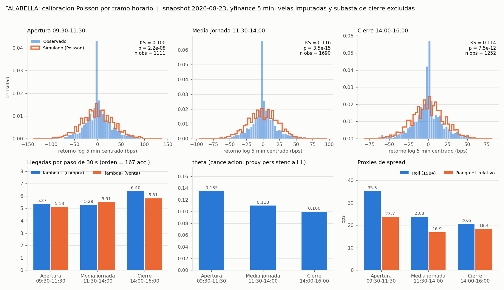

# Calibración del modelo de Poisson (λ⁺, λ⁻, θ) por tramo horario — Tarea 2.1.3

**Proyecto:** Coordinación de Agentes para la Mitigación del Slippage (IPSA) — Título II, UTEM
**Responsable:** Benjamín Farias (BF). La API y el modelo base (`PoissonLOBModel`, `calibrate_poisson_params`) son de Paolo Sepúlveda (PS).
**Código:** [`src/envs/calibration_poisson.py`](../src/envs/calibration_poisson.py) · **Tests:** [`tests/test_calibration_poisson.py`](../tests/test_calibration_poisson.py)
**Salidas:** [`data/calibration/poisson_params_2026-08-23.json`](../data/calibration/poisson_params_2026-08-23.json) · [`results/sprint3/FALABELLA_poisson_por_tramo.png`](../results/sprint3/FALABELLA_poisson_por_tramo.png)

---

## 1. Objetivo y alcance

La tarea 2.1.3 calibra los parámetros del modelo de llegadas de órdenes tipo Poisson que alimentará la capa de simulación de los Agentes Ejecutores. Siguiendo el Título I (§4.3.3) y a Cont, Stoikov & Talreja (2010), el libro de órdenes se describe mediante tres intensidades:

- **λ⁺**: tasa de llegada de órdenes de compra.
- **λ⁻**: tasa de llegada de órdenes de venta.
- **θ**: tasa de cancelación.

La versión inicial del módulo calibraba un único triple para toda la jornada y solo se había ejecutado con datos sintéticos. Esta versión estima un triple por **ticker × tramo horario**, con datos reales del snapshot `clean_5m_2026-08-23` (30 tickers del IPSA, 2026-05-28 a 2026-08-21, velas de 5 min de yfinance). Los tramos coinciden con los de los Ejecutores (`SE_schema.json`, `docs/arquitectura_entorno_simulacion.md` §3.1):

| Tramo | Intervalo (America/Santiago) | Velas de 5 min por día |
|---|---|---:|
| `apertura` | [09:30, 11:30) | 24 |
| `media_jornada` | [11:30, 14:00) | 30 |
| `cierre` | [14:00, 16:00] | 24 |

La calibración **aproxima** la dinámica de llegadas del mercado real a partir de datos agregados. No pretende reproducir el libro de órdenes real, que no se observa: los datos no incluyen Nivel 2.

> **Nota de consistencia.** La variable `sesion` de S_M (`build_sm_features.py`, arquitectura §4.1) usa cortes por hora exacta: [9,11), [11,14), [14,16]. Los Ejecutores usan 11:30 como corte. Esta calibración sigue a los Ejecutores, porque son quienes consumen λ y θ. La diferencia de 30 min en el primer corte queda documentada para el Sprint Review.

## 2. Datos de entrada

- **Archivo:** `data/processed/clean_5m_2026-08-23/<TICKER>.parquet`, generado por la tarea 1.2.1. El loader acepta el ticker con o sin `.SN` (`FALABELLA`, `FALABELLA.SN` o `falabella.sn`) y, si no se indica `--snapshot`, usa el snapshot fechado más reciente.
- **Columnas:** en ese parquet, `open/high/low/close/volume` están normalizadas con MinMaxScaler por ticker. La calibración usa **siempre las columnas `*_raw`**, es decir, precios en CLP y volumen en acciones.
- **Velas excluidas:**
  - Las velas con `is_imputed = True` (sin transacción real, rellenadas por ffill o bfill) se excluyen de todas las estimaciones. En FALABELLA son 337 de 4680.
  - La vela **15:55** también se excluye, porque en 1.2.1 se le fusiona la subasta de cierre (`CLOSING_AUCTION_NOTE` en `clean_ohlcv.py`). En FALABELLA esa vela promedia unas 560 mil acciones, alrededor de 13 veces una vela típica del tramo. Ese volumen proviene de un mecanismo de subasta y no del flujo continuo de órdenes que describe el proceso de Poisson.

## 3. Metodología y fórmulas

Sea *b* una vela observada del tramo *k*, con *O_b*, *H_b*, *L_b*, *C_b* y *V_b* sus valores sin normalizar. Sea *Δt* = 30 s el paso de decisión del Ejecutor, de modo que cada vela de 5 min contiene *m* = 10 pasos.

### 3.1 λ⁺ y λ⁻: volumen firmado

**Paso 1: signo de la vela** (regla de clasificación documentada):

$$
s_b = \begin{cases} \operatorname{sign}(C_b - O_b) & \text{si } C_b \neq O_b \\ \operatorname{sign}(C_b - C_{b-1}) & \text{si } C_b = O_b \quad \text{(tick rule contra el último cierre del mismo día)} \\ 0 & \text{en otro caso} \end{cases}
$$

**Paso 2: reparto del volumen.** El volumen comprador y el vendedor son

$$
V_b^{+} = V_b\,\mathbb{1}[s_b>0] + \tfrac12 V_b\,\mathbb{1}[s_b=0], \qquad V_b^{-} = V_b\,\mathbb{1}[s_b<0] + \tfrac12 V_b\,\mathbb{1}[s_b=0]
$$

**Paso 3: tasa en órdenes por paso de 30 s.** Con *N_k* velas observadas en el tramo:

$$
\hat\lambda^{\pm}_k = \frac{\sum_{b\in k} \tilde V_b^{\pm}}{N_k \cdot m \cdot \bar q}
$$

donde:

- $\bar q$ es el tamaño medio de orden (`avg_order_size`), un supuesto explícito descrito en §4.
- $\tilde V_b = \min(V_b, V^{(0.99)})$ es el volumen **winsorizado** en el percentil 99 de las velas observadas del ticker.

**Por qué se winsoriza.** En FALABELLA, 5 velas concentran el 72 % del volumen de apertura. Una de ellas, del 2026-08-12 a las 10:30, suma 25 millones de acciones. Son operaciones en bloque y no flujo de órdenes de tamaño medio. Sin winsorizar, λ⁺ de apertura sube de 5,37 a 29,06 y el desbalance compra/venta pasa a ser de 4 a 1 (§5.3).

Con este estimador, λ es el estimador de máxima verosimilitud de la intensidad de un proceso de Poisson homogéneo dentro del tramo, dado $\bar q$.

### 3.2 θ: persistencia del rango high-low

Sin Nivel 2 no se observan cancelaciones. θ se aproxima mediante la velocidad con que se disipan los shocks de liquidez, medidos con el rango relativo de cada vela, que funciona como proxy de spread y profundidad:

$$
HL_b = \frac{H_b - L_b}{(H_b + L_b)/2}
$$

Si los shocks de spread o profundidad decaen a una tasa θ por paso, la autocorrelación de orden 1 entre velas consecutivas, separadas por *m* pasos, es ρ = e^{−mθ}. De ahí:

$$
\hat\theta_k = -\frac{\ln \hat\rho_k}{m}, \qquad \hat\rho_k = \operatorname{corr}(HL_b, HL_{b-1}),\quad \hat\rho_k \in [0{,}01;\ 0{,}99]
$$

El par (*b*−1, *b*) se usa solo si ambas velas están observadas y pertenecen al mismo día y al mismo tramo. El recorte de ρ̂ acota θ̂ a [0,001; 0,461]. En 8 de los 90 pares ticker × tramo el recorte se activa (campo `hl_ar1_clipped`), todos en tickers de baja cobertura.

### 3.3 Proxies de spread

Se reportan dos proxies:

- **Estimador de Roll (1984), relativo**, con *r_b* = ln(*C_b*/*C_{b−1}*) entre velas observadas consecutivas del mismo tramo:

$$
S^{Roll}_k = 2\sqrt{-\operatorname{cov}(r_b, r_{b-1})} \times 10^4 \ \text{bps} \qquad (\text{indefinido si la covarianza es} \ge 0)
$$

- **Rango HL relativo medio**, $\overline{HL}_k \times 10^4$ bps.

### 3.4 Modelo simulado y validación KS

`PoissonLOBModel` (PS) genera, en cada paso *j*, el impacto

$$
\Delta_j = \frac{N^{+}_j - N^{-}_j}{1 + C_j}, \qquad N^{\pm}_j\sim\text{Poisson}(\lambda^{\pm}),\ C_j\sim\text{Poisson}(\theta)
$$

Un retorno simulado de 5 min es la suma de *m* = 10 pasos, reescalada para que su desviación estándar sea igual a la observada. El impacto por orden neta queda así fijado por momentos.

**Validación.** Por tramo, un test de Kolmogorov–Smirnov de 2 muestras (`scipy.stats.ks_2samp`) compara:

- 5000 retornos simulados;
- los retornos observados entre velas no imputadas consecutivas del mismo día y tramo.

**Por qué se centran ambas muestras.** En este modelo reducido, cualquier desbalance λ⁺ ≠ λ⁻ se traduce en una deriva determinista de m·(λ⁺−λ⁻)·E[1/(1+C)] por vela. En el cierre de FALABELLA equivale a 0,53 desviaciones estándar por vela (campo `sim_drift_sd`), mientras que los retornos observados tienen media prácticamente nula. Sin centrar, el KS castigaría ese artefacto del modelo y no la forma de la distribución. Con las muestras centradas, el KS evalúa la **forma** de la distribución: colas, masa en cero y asimetría.

La semilla de cada ticker × tramo se deriva de `(seed, crc32(ticker), índice del tramo)`, por lo que los resultados son deterministas.

### 3.5 MLE-proxy (método alternativo)

`calibrate_poisson_params` (PS) se conserva y se aplica por tramo, con las estimaciones directas como x₀ y límites [x₀/20, 20·x₀] para λ. Una vez fijada la escala por momentos, su función objetivo depende solo de la forma de la distribución simulada, que es casi invariante a multiplicar λ⁺ y λ⁻ por una misma constante. Por eso el objetivo **no identifica el nivel de λ**, que sí queda identificado por el volumen.

El MLE-proxy se adopta como estimación principal solo si se cumplen tres condiciones a la vez:

1. mejora el estadístico KS;
2. el optimizador converge;
3. ningún parámetro queda en un límite.

En FALABELLA no se adopta en ningún tramo:

- en apertura mejora marginalmente el KS (0,097 frente a 0,100), pero no converge y lleva θ a 0,96;
- en media jornada no mejora;
- en cierre no mejora y lleva θ al límite inferior.

Entre los 90 pares ticker × tramo se adopta en 5: BCI y CENCOSUD (apertura), CCU y CONCHATORO (media jornada) y LTM (apertura). El resultado del MLE-proxy queda siempre registrado en el campo `mle_proxy` del JSON, y la estimación directa en el campo `directo`.

## 4. Supuestos

| # | Supuesto | Efecto |
|---|---|---|
| S1 | **Tamaño medio de orden:** $\bar q$ = round(1.000.000 CLP / mediana de `close_raw`) por ticker. Es un nocional fijo por orden, porque yfinance no entrega número de transacciones. Para FALABELLA, $\bar q$ = 167 acciones. Se puede cambiar con `--avg-order-size` o `--order-notional-clp`. | λ escala como 1/$\bar q$; θ no depende de $\bar q$ (§6). |
| S2 | Signo del volumen por el cuerpo de la vela, con tick rule de respaldo y reparto 50/50 si no hay cambio. | En FALABELLA, entre 13 % y 23 % de las velas de cada tramo se firman por tick rule (`share_tick_rule`). |
| S3 | Volumen winsorizado en el percentil 99 del ticker; se desactiva con `--volume-winsor-q 1.0`. | Excluye operaciones en bloque aisladas (§3.1, §5.3). |
| S4 | λ es condicional a velas con transacción: las velas imputadas no entran al denominador. | El nivel no condicional se obtiene multiplicando por (1 − `imputed_share`). |
| S5 | La vela 15:55 (subasta de cierre) se excluye; se incluye con `--include-closing-auction`. | La subasta no es flujo continuo de órdenes. |
| S6 | θ se aproxima por la persistencia AR(1) del rango HL (§3.2). | Proxy indirecto: ver limitaciones. |
| S7 | Validación KS con escala fijada por momentos y muestras centradas (§3.4). | El KS evalúa la forma, no la media ni la escala. |

## 5. Resultados

### 5.1 FALABELLA por tramo

Tier A, cobertura pre-fill 92,93 %, $\bar q$ = 167 acciones y tope de winsorización de 297 362 acciones por vela. λ está en órdenes por paso de 30 s y θ en cancelaciones por paso de 30 s.

| Tramo | λ⁺ | λ⁻ | λ⁺+λ⁻ | θ | ρ̂_HL | Roll (bps) | HL (bps) | Velas obs. / total | Retornos | KS | p-valor | Método |
|---|---:|---:|---:|---:|---:|---:|---:|---:|---:|---:|---:|---|
| apertura | 5,369 | 5,126 | 10,49 | 0,135 | 0,259 | 35,3 | 23,7 | 1274 / 1440 | 1111 | 0,100 | 2,2·10⁻⁸ | directo |
| media_jornada | 5,294 | 5,511 | 10,81 | 0,110 | 0,332 | 23,8 | 16,9 | 1740 / 1800 | 1690 | 0,116 | 3,5·10⁻¹⁵ | directo |
| cierre | 6,400 | 5,811 | 12,21 | 0,100 | 0,369 | 20,6 | 18,4 | 1269 / 1380 | 1252 | 0,114 | 7,5·10⁻¹² | directo |

En cierre, el total de velas (1380) excluye las 60 velas de subasta de las 15:55.



### 5.2 Validación KS

**FALABELLA.** En los tres tramos se rechaza, al 5 %, la hipótesis de que los retornos simulados y los observados provengan de la misma distribución. Los estadísticos van de 0,100 a 0,116. La discrepancia principal es visible en la figura: los retornos observados concentran mucha masa exactamente en cero, por la discreción del tick y la iliquidez de la vela de 5 min, y tienen colas más pesadas que la suma de 10 pasos Poisson, que tiende a una forma más gaussiana.

**Los 30 tickers.** Ninguno de los 90 pares ticker × tramo supera p = 0,05; el mayor p-valor es 0,0074. La mediana del estadístico KS es 0,178 en apertura, 0,172 en media jornada y 0,169 en cierre. El mejor ajuste es el de SQM-B (KS entre 0,056 y 0,067) y los peores son los de los tickers tier B de menor cobertura, como IAM (KS entre 0,30 y 0,34).

**Interpretación.** Con datos de 5 min, el modelo reducido aproxima el nivel de actividad y la escala de las variaciones, pero no la forma fina de la distribución de retornos. Para el simulador, esto indica que λ y θ calibrados son adecuados como **intensidades de entrada** de ABIDES-Gym. No lo son como generador directo de retornos de 5 min.

### 5.3 Hecho estilizado de media jornada

La literatura intradiaria anticipa, en media jornada, menor intensidad de órdenes y spread mayor que en apertura y cierre. El resultado se reporta tal como se obtuvo, sin forzarlo.

**FALABELLA:**

| Hecho esperado | Resultado | Detalle |
|---|---|---|
| λ⁺+λ⁻ menor en media jornada (volumen winsorizado, estimación principal) | **No se cumple** | 10,49 (apertura) < 10,81 (media jornada) < 12,21 (cierre) |
| λ⁺+λ⁻ menor en media jornada (volumen sin winsorizar, sensibilidad) | **Se cumple** | 36,28 (apertura) > 15,28 (media jornada) < 24,61 (cierre) |
| Spread Roll mayor en media jornada | **No se cumple** | 35,3 (apertura) > 23,8 (media jornada) > 20,6 (cierre) |
| Rango HL mayor en media jornada | **No se cumple** | 23,7 (apertura) > 16,9 (media jornada) < 18,4 (cierre) |

En FALABELLA, el patrón de "valle" en la actividad de media jornada depende de las operaciones en bloque, que se concentran en apertura y cierre. Con el flujo de tamaño típico, la intensidad es prácticamente plana entre apertura y media jornada, y algo mayor en cierre.

Ambos proxies de spread muestran un patrón decreciente a lo largo del día: el spread es mayor en la apertura, no en media jornada. Esto es coherente con un patrón en forma de L, frecuente en mercados de liquidez fina, más que con uno en forma de U.

**Los 30 tickers** (verdaderos / total):

| Condición | Todos | Tier A |
|---|---:|---:|
| λ total menor en media jornada (winsorizado) | 6 / 30 | 3 / 15 |
| λ total menor en media jornada (sin winsorizar) | 8 / 30 | 5 / 15 |
| Roll mayor en media jornada (2 tickers con Roll indefinido) | 6 / 30 | 3 / 15 |
| Rango HL mayor en media jornada | 1 / 30 | 0 / 15 |

**Conclusión.** En el snapshot 2026-08-23 el hecho estilizado no se verifica de forma general en el IPSA. Esto no invalida la calibración: indica que la estacionalidad intradiaria del mercado chileno en esta ventana difiere del patrón clásico. Precisamente por eso conviene parametrizar por tramo.

### 5.4 Cobertura del universo

Se calibraron los 30 tickers del snapshot, y todos los parámetros son > 0 y finitos. El JSON marca `cobertura_baja = true` en los 15 tickers tier B (cobertura pre-fill < 60 %, según `cleaning_report.json`). Sus parámetros se basan en menos velas observadas y concentran los θ recortados y los peores KS. Se recomienda usarlos solo para caracterización agregada.

## 6. Sensibilidad (FALABELLA)

| Nocional por orden (CLP) | $\bar q$ (acc.) | λ⁺ / λ⁻ apertura | λ⁺ / λ⁻ media jornada | λ⁺ / λ⁻ cierre | θ (a / m / c) | KS (a / m / c) |
|---:|---:|---|---|---|---|---|
| 250 000 | 42 | 21,35 / 20,38 | 21,05 / 21,91 | 25,45 / 23,11 | 0,135 / 0,110 / 0,100 | 0,096 / 0,116 / 0,109 |
| **1 000 000** (base) | **167** | **5,37 / 5,13** | **5,29 / 5,51** | **6,40 / 5,81** | **0,135 / 0,110 / 0,100** | **0,100 / 0,116 / 0,114** |
| 5 000 000 | 837 | 1,07 / 1,02 | 1,06 / 1,10 | 1,28 / 1,16 | 0,135 / 0,110 / 0,100 | 0,115 / 0,131 / 0,126 |
| 1 000 000, sin winsorizar | 167 | 29,06 / 7,22 | 9,03 / 6,26 | 15,82 / 8,78 | 0,135 / 0,110 / 0,100 | 0,103 / 0,117 / 0,100 |

Qué muestra la tabla:

- λ es inversamente proporcional al supuesto $\bar q$; las **razones entre tramos** no dependen de él.
- θ no depende ni de $\bar q$ ni de la winsorización.
- El KS cambia poco con $\bar q$ (entre 0,096 y 0,131), lo que confirma que el rechazo no se debe a la elección de $\bar q$.

## 7. Limitaciones

1. **Sin Nivel 2.** No se observan cotizaciones, profundidad ni cancelaciones. El signo del volumen, θ y el spread son proxies construidos desde velas OHLCV. θ mide la persistencia de la iliquidez de corto plazo y aproxima, pero no mide, la tasa de cancelación de Cont, Stoikov & Talreja (2010). La autocorrelación del rango HL también refleja la agrupación de volatilidad.
2. **Velas de 5 min.** La resolución es 10 veces más gruesa que el paso del Ejecutor (30 s), por lo que λ supone intensidad constante dentro de cada vela. Además, yfinance no entrega el número de transacciones, y de ahí el supuesto S1.
3. **Cobertura heterogénea.** En la mitad del IPSA (tier B) más del 40 % de las velas no tiene transacciones. λ condicional (S4) sobrestima la actividad no condicional de esos tickers.
4. **Subasta de cierre y operaciones en bloque.** Se excluyen o winsorizan por no ser flujo continuo (S3, S5). Si el simulador debe representarlas, requieren un componente aparte, como un proceso de saltos o una subasta explícita.
5. **Modelo reducido de validación.** `PoissonLOBModel` no representa colas del libro ni la dinámica de colas de Cont, Stoikov & Talreja; el KS evalúa solo la forma de la distribución de retornos de 5 min (§3.4).
6. **Cambio de régimen: transición del IPSA a MSCI el 1-sep-2026.** El snapshot termina el 2026-08-21, antes de la transición. Los parámetros representan el régimen previo. Tras el 1-sep-2026 pueden cambiar la composición del índice, los flujos de fondos indexados y la estacionalidad intradiaria (en particular en el cierre y en las fechas de rebalanceo). Se recomienda recalibrar con un snapshot posterior antes de usar estos parámetros en la evaluación final.
7. **Ventana corta.** 60 días hábiles, limitados por yfinance a 60 días de historia en 5 min. El snapshot no se puede volver a descargar después de esa ventana (ver `docs/evidencia_pipeline_datos_BF.md` §4).

## 8. Reproducción

```bash
# FALABELLA (activo MVP)
python -m src.envs.calibration_poisson --snapshot 2026-08-23 --tickers FALABELLA
# Universo completo (sobrescribe el JSON con los 30 tickers; ~3 min)
python -m src.envs.calibration_poisson --snapshot 2026-08-23 --all
# Sensibilidad
python -m src.envs.calibration_poisson --snapshot 2026-08-23 --tickers FALABELLA --order-notional-clp 5000000 --output /tmp/sens.json --plot-ticker ""
# Smoke-test sintético original de PS (salidas en data/calibration/demo/, ignorado por git)
python -m src.envs.calibration_poisson --demo
# Tests
pytest tests/test_calibration_poisson.py
```

## Referencias

- Cont, R., Stoikov, S., & Talreja, R. (2010). A stochastic model for order book dynamics. *Operations Research*, 58(3), 549–563.
- Roll, R. (1984). A simple implicit measure of the effective bid-ask spread in an efficient market. *Journal of Finance*, 39(4), 1127–1139.
