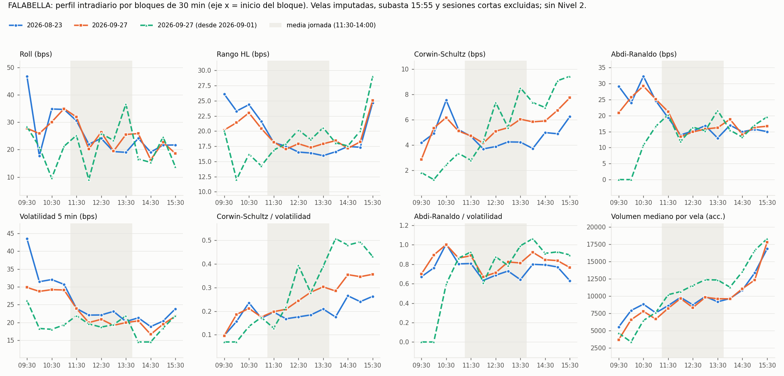
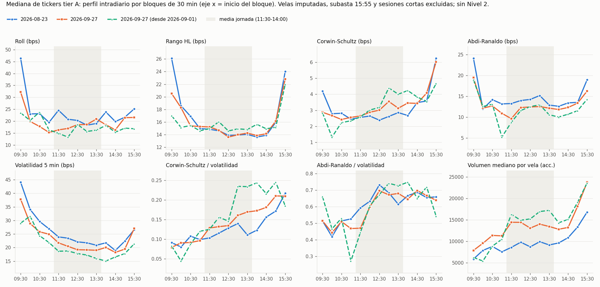

# Robustez del patrón intradiario de spread y actividad en el IPSA — Tarea 2.1.3b

**Proyecto:** Coordinación de Agentes para la Mitigación del Slippage (IPSA) — Título II, UTEM
**Responsable:** Benjamín Farias (BF)
**Código:** [`src/analysis/intraday_profile.py`](../src/analysis/intraday_profile.py) · **Tests:** [`tests/test_intraday_profile.py`](../tests/test_intraday_profile.py)
**Salidas:** [`data/calibration/robustez_patron_intradiario.json`](../data/calibration/robustez_patron_intradiario.json) · [`results/sprint3/FALABELLA_perfil_30min.png`](../results/sprint3/FALABELLA_perfil_30min.png) · [`results/sprint3/tierA_perfil_30min.png`](../results/sprint3/tierA_perfil_30min.png)

---

## 1. Pregunta

El Título I (§4.3.3 y §4.3.5) supone que en la media jornada (11:30–14:00) el spread es mayor y la actividad menor que en la apertura y el cierre. En la tarea 2.1.3, con el estimador de Roll y el rango high-low (HL) sobre velas de 5 min, el spread más ancho apareció en la **apertura**: la mediana de los 30 tickers del Roll fue 32, 24 y 23 bps en apertura, media jornada y cierre.

Roll y HL mezclan spread con volatilidad, y la volatilidad es máxima en la apertura. Esta tarea no busca "arreglar" el resultado. Busca confirmarlo o descartarlo con dos estimadores que separan mejor ambos efectos, en un segundo snapshot y con intervalos de confianza. El resultado se reporta tal como se obtuvo.

## 2. Datos y exclusiones

| Snapshot | Ventana | Días usados | Tickers tier A | Observaciones |
|---|---|---:|---:|---|
| `2026-08-23` | 2026-05-28 a 2026-08-21 | 60 | 15 | Snapshot de la 2.1.3, sin cambios. |
| `2026-09-27` | 2026-07-02 a 2026-09-25 | 59 | 16 | Descargado para esta tarea. Se excluye 2026-09-17 (sesión corta, víspera de Fiestas Patrias). Tier A suma VAPORES. |
| `2026-09-27` desde 2026-09-01 | 2026-09-01 a 2026-09-25 | 17 | 16 | Subconjunto posterior a la transición del IPSA a MSCI. |

- **Columnas y velas:** se usan las columnas `*_raw` de `clean_5m_<fecha>` y se excluyen las velas con `is_imputed=True`.
- **Subasta de cierre:** se excluye la vela 15:55, que contiene la subasta (`INCLUDE_CLOSING_AUCTION = False` en [`src/config/market_params.py`](../src/config/market_params.py)).
- **Sesiones cortas:** se excluyen los días en que menos de la mitad de los tickers transa después de las 14:00. En esos días la subasta cae dentro de la media jornada y contaminaría la comparación.
- **Tramos:** son los del Ejecutor: apertura [09:30, 11:30), media_jornada [11:30, 14:00) y cierre [14:00, 16:00].

**Advertencias sobre el snapshot nuevo:**

1. **No es independiente del anterior.** yfinance entrega solo los últimos 60 días de velas de 5 min, así que los dos snapshots comparten 36 días hábiles (2026-07-02 a 2026-08-21). Solo 24 días son nuevos.
2. **Muestra corta después del 1-sep.** Solo 17 días son posteriores a la transición a MSCI. Esa variante se reporta como indicio, no como evidencia concluyente. Con tan pocos días, Roll queda indefinido en la mitad de los tickers.
3. **Cambio de horario.** La ventana cruza el cambio de horario de Chile del 2026-09-06 (UTC−4 → UTC−3). Se verificó que la sesión sigue en 09:30–16:00 hora local, porque el pipeline trabaja con zona horaria (tz-aware). El campo `dst_note` de `cleaning_report.json` es un texto fijo de `clean_ohlcv.py` que describe la ventana del snapshot 2026-08-23; para este snapshot está desactualizado.

## 3. Métodos

Todos los estimadores entregan el spread **relativo**, en puntos base. Un "par" (t−1, t) exige que ambas velas estén observadas y pertenezcan al mismo día y al mismo tramo (o bloque).

| Estimador | Fórmula | Qué capta |
|---|---|---|
| Roll (1984) | S = 2·√(−cov(r_t, r_{t−1})); indefinido si cov ≥ 0 | Rebote bid-ask en los cierres. En 5 min también capta reversiones transitorias. |
| Rango HL | media de (H−L)/((H+L)/2) | Spread más volatilidad intra-vela. |
| Corwin-Schultz (2012) | β = ln²(H₀/L₀) + ln²(H₁/L₁); γ = ln²(max H / min L); α = (√(2β) − √β)/(3 − 2√2) − √(γ/(3 − 2√2)); S = 2(e^α − 1)/(1 + e^α) | Separa spread de varianza: la varianza escala con el largo del intervalo (β frente a γ) y el spread no. Incluye el ajuste por salto entre velas y fija en 0 los pares negativos. |
| Abdi-Ranaldo (2017) | η = (ln H + ln L)/2; S = √max(4·E[(c_{t−1} − η_{t−1})(c_{t−1} − η_t)], 0) | Distancia del cierre al punto medio del rango; es robusto a la volatilidad si esta es constante entre las dos velas. |

Además se calculan:

- **Volatilidad:** desviación estándar del retorno logarítmico de 5 min (la misma `obs_return_std` de la 2.1.3).
- **Spread / volatilidad**, para cada estimador.
- **Actividad:** volumen **mediano** por vela observada (la mediana evita que una operación en bloque domine) y fracción de velas con transacción.

**Validación del código.** Los tests cubren los siguientes casos:

- **Casos exactos.** Con H = ask y L = bid fijos, Corwin-Schultz devuelve exactamente 2(H−L)/(H+L). Con el punto medio constante, Abdi-Ranaldo devuelve ln(ask/bid).
- **Modelo de Roll simulado.** Con un spread verdadero de 20 bps, Roll, Corwin-Schultz y Abdi-Ranaldo lo recuperan dentro de un 25 %, mientras que HL lo sobrestima.
- **Consistencia con la 2.1.3.** En FALABELLA, Roll, HL y la volatilidad reproducen exactamente los valores de la 2.1.3.

**Robustez.**

- **Bootstrap por días (FALABELLA).** Se remuestrean días completos 500 veces, lo que conserva la dependencia intradiaria, y se obtienen intervalos de confianza (IC) al 95 % para las diferencias media − apertura y media − cierre.
- **Perfil por bloques de 30 min.** Se construye un perfil en 13 bloques para FALABELLA y para la mediana de los tickers tier A.

## 4. Resultados

### 4.1 Veredicto por estimador y snapshot

Cada celda indica cuántos tickers cumplen el criterio sobre los tickers con el estimador definido en los tres tramos. El criterio es **estricto**: la media jornada debe superar tanto a la apertura como al cierre.

| Snapshot | Estimador | Media jornada con mayor spread (todos) | Ídem, tier A | Tramo con el mayor spread en tier A (a / m / c) | Media jornada con mayor spread/vol., tier A |
|---|---|---:|---:|---|---:|
| 2026-08-23 | Roll | 6 / 28 | 3 / 15 | 8 / 3 / 4 | 8 / 15 |
| 2026-08-23 | HL | 1 / 30 | 0 / 15 | 12 / 0 / 3 | 1 / 15 |
| 2026-08-23 | Corwin-Schultz | 2 / 30 | 0 / 15 | 6 / 0 / **9** | 1 / 15 |
| 2026-08-23 | Abdi-Ranaldo | 8 / 30 | 3 / 15 | 8 / 3 / 4 | 6 / 15 |
| 2026-09-27 | Roll | 7 / 29 | 3 / 16 | 8 / 3 / 5 | 7 / 16 |
| 2026-09-27 | HL | 1 / 30 | 0 / 16 | 10 / 0 / 6 | 2 / 16 |
| 2026-09-27 | Corwin-Schultz | 2 / 30 | 1 / 16 | 2 / 1 / **13** | 2 / 16 |
| 2026-09-27 | Abdi-Ranaldo | 9 / 30 | 3 / 16 | 7 / 3 / 6 | 7 / 16 |
| desde 2026-09-01 | Roll | 3 / 15 | 2 / 11 | 6 / 2 / 3 | 2 / 11 |
| desde 2026-09-01 | HL | 5 / 30 | 0 / 16 | 6 / 0 / 10 | 4 / 16 |
| desde 2026-09-01 | Corwin-Schultz | 7 / 30 | 3 / 16 | 3 / 3 / **10** | 3 / 16 |
| desde 2026-09-01 | Abdi-Ranaldo | 7 / 30 | 3 / 16 | 9 / 3 / 4 | 5 / 16 |

**Actividad (volumen mediano por vela): tickers con la media jornada como tramo de menor actividad.**

| Snapshot | Todos | Tier A | Tramo de menor actividad en tier A (a / m / c) |
|---|---:|---:|---|
| 2026-08-23 | 5 / 30 | 4 / 15 | 11 / 4 / 0 |
| 2026-09-27 | 2 / 30 | 2 / 16 | 14 / 2 / 0 |
| desde 2026-09-01 | 1 / 30 | 0 / 16 | 16 / 0 / 0 |

Con la fracción de velas con transacción, la media jornada es el tramo menos activo en **0** tickers en los tres casos.

**Volatilidad.** La volatilidad de 5 min es máxima en la apertura en 15/15, 14/16 y 14/16 tickers tier A, respectivamente.

### 4.2 Medianas por tramo (tier A)

Cada celda muestra apertura / media jornada / cierre.

| Métrica | 2026-08-23 | 2026-09-27 | desde 2026-09-01 |
|---|---|---|---|
| Roll (bps) | 30,4 / 21,2 / 22,6 | 21,4 / 18,7 / 20,3 | 22,8 / 14,3 / 15,4 |
| HL (bps) | 18,3 / 13,9 / 16,3 | 17,6 / 14,8 / 16,5 | 15,2 / 14,8 / 16,7 |
| Corwin-Schultz (bps) | 2,9 / 2,7 / 3,7 | 2,6 / 3,1 / 4,0 | 2,5 / 3,5 / 4,0 |
| Abdi-Ranaldo (bps) | 17,5 / 13,6 / 15,5 | 14,2 / 12,1 / 14,9 | 14,1 / 12,7 / 12,7 |
| Volatilidad (bps) | 33,6 / 22,3 / 24,1 | 28,7 / 20,6 / 22,5 | 27,5 / 18,9 / 17,9 |
| Corwin-Schultz / vol. | 0,09 / 0,12 / 0,16 | 0,09 / 0,15 / 0,17 | 0,09 / 0,18 / 0,22 |
| Abdi-Ranaldo / vol. | 0,54 / 0,63 / 0,67 | 0,48 / 0,65 / 0,66 | 0,50 / 0,65 / 0,66 |
| Volumen mediano por vela (acc.) | 7 580 / 9 400 / 11 960 | 9 970 / 13 900 / 15 500 | 7 410 / 16 400 / 17 600 |

Los niveles de los estimadores no son comparables entre sí. Corwin-Schultz entrega 2–4 bps y Roll entre 14 y 30 bps, porque cada uno capta un componente distinto en velas de 5 min. El análisis compara solo el **orden entre tramos** de cada estimador.

### 4.3 FALABELLA

| Métrica (a / m / c) | 2026-08-23 | 2026-09-27 | desde 2026-09-01 |
|---|---|---|---|
| Roll (bps) | 35,3 / 23,8 / 20,6 | 32,4 / 25,2 / 20,2 | 16,6 / 25,1 / 18,6 |
| HL (bps) | 23,7 / 16,9 / 18,4 | 21,3 / 17,7 / 19,2 | 15,2 / 18,8 / 20,4 |
| Corwin-Schultz (bps) | 5,7 / 4,1 / 4,9 | 5,3 / 5,1 / 6,3 | 2,7 / 5,9 / 7,9 |
| Abdi-Ranaldo (bps) | 28,2 / 16,3 / 15,5 | 26,8 / 17,1 / 16,1 | 12,4 / 18,0 / 15,8 |
| Volatilidad (bps) | 34,0 / 22,3 / 20,9 | 29,3 / 20,9 / 19,5 | 19,5 / 20,4 / 17,1 |
| Volumen mediano por vela (acc.) | 7 576 / 9 396 / 11 964 | 6 420 / 9 180 / 11 600 | 6 090 / 11 600 / 13 900 |

**Bootstrap por días de FALABELLA (500 réplicas): diferencia media jornada − apertura, en bps, con IC 95 %.**

| Estimador | 2026-08-23 | 2026-09-27 | desde 2026-09-01 |
|---|---|---|---|
| Roll | −11,4 [−19,7; −2,7] | −7,2 [−14,3; −0,2] | +8,5 [−1,6; 17,8] |
| HL | −6,9 [−9,0; −4,1] | −3,7 [−6,6; −0,7] | +3,6 [−2,5; 9,9] |
| Corwin-Schultz | −1,6 [−2,8; −0,4] | −0,2 [−1,6; 1,1] | +3,2 [0,9; 5,6] |
| Abdi-Ranaldo | −12,0 [−17,5; −7,2] | −9,8 [−15,6; −4,5] | +5,6 [−1,0; 12,9] |
| Volatilidad | −11,6 [−14,9; −8,0] | −8,4 [−11,8; −5,4] | +0,9 [−3,2; 4,6] |

- **Media jornada − cierre.** Con ningún estimador de spread el IC excluye el cero con signo positivo. La media jornada nunca resulta significativamente más ancha que el cierre.
- **Volumen mediano.** Es mayor en la media jornada que en la apertura en los tres casos, con IC que excluyen el cero: +1 820, +2 761 y +5 470 acciones por vela.





## 5. Conclusiones

1. **Se descarta el supuesto del Título I sobre el spread.** Que la media jornada tenga el mayor spread no se verifica con ninguno de los cuatro estimadores ni en ninguno de los tres cortes de datos: lo cumplen como máximo 3 de 15–16 tickers tier A. Al normalizar por volatilidad el resultado depende del estimador:
   - con Corwin-Schultz y HL, la media jornada tiene el mayor cociente en ≤ 4 de 16 tickers tier A, y el cierre en 12–14;
   - con Roll y Abdi-Ranaldo, lo tiene en 6–8 de 15–16 en los snapshots completos, es decir, compite con el cierre.

   Por unidad de volatilidad, el spread de media jornada es comparable al del cierre, no mayor.
2. **Se descarta el supuesto del Título I sobre la actividad.** El valle de actividad en la media jornada no aparece: el tramo menos activo es la **apertura**, tanto por volumen mediano por vela como por fracción de velas con transacción. La actividad crece a lo largo del día. Como la media jornada dura más (30 velas frente a 24), concentra la mayor participación en el volumen diario, aunque su actividad por vela no sea la mayor.
3. **El hallazgo de la 2.1.3 ("apertura con el mayor spread") se confirma solo en parte.** Con Roll, HL y Abdi-Ranaldo, la apertura es el tramo más ancho en la mayoría relativa de los tickers tier A. En FALABELLA la diferencia es significativa en ambos snapshots completos. Con Corwin-Schultz, en cambio, el máximo está en el **cierre** (9/15 y 13/16 tickers tier A). Al dividir por la volatilidad, la apertura pasa a ser el tramo con el cociente **más bajo** con los cuatro estimadores: es el mínimo en 10–16 de 15–16 tickers tier A en ambos snapshots completos. Como la apertura concentra la volatilidad (14–15 de 15–16 tickers), con velas OHLC de 5 min no se puede atribuir su mayor "spread" a un spread efectivo mayor y no a la volatilidad. La conclusión que se sostiene es que **la media jornada no es el tramo más ancho**. El ordenamiento entre apertura y cierre depende del estimador.
4. **Primeras semanas post-MSCI.** En los 17 días posteriores al 1-sep, FALABELLA muestra la media jornada más ancha que la apertura con Corwin-Schultz (IC 95 % sin el cero), mientras que la volatilidad de apertura baja a niveles de media jornada. Es un cambio que conviene seguir con más días; no alcanza para concluir un cambio de régimen.
5. **Implicancia para el proyecto.** La validación del simulador (2.2.4, 2.2.5) no debería exigir una regla fija del tipo "media jornada = mayor spread / menor actividad". Debería exigir que el simulador reproduzca los **valores y rankings observados** por tramo que quedan en el bloque `objetivos_validacion` de [`poisson_params_2026-08-23.json`](../data/calibration/poisson_params_2026-08-23.json) (Parte B). Los rankings robustos, que se repiten en los tres cortes de datos, son dos: la volatilidad es máxima en la apertura y el volumen por vela crece a lo largo del día. El spread conviene compararlo con más de un estimador y también normalizado por volatilidad.

## 6. Limitaciones

- **Sin Nivel 2.** El proyecto no dispone de cotizaciones bid/ask, profundidad ni cancelaciones. Los cuatro estimadores son **proxies** del spread construidos desde OHLC de 5 min de yfinance, y ninguno mide el spread cotizado. Todos se sesgan por:
  - la discreción del tick;
  - la volatilidad intra-vela;
  - la iliquidez: en los tickers tier B, más del 40 % de las velas no tiene transacciones.

  Una confirmación definitiva del patrón de spread requiere datos de Nivel 1 o Nivel 2 de la Bolsa de Santiago.
- **Supuestos de Corwin-Schultz y Abdi-Ranaldo.** Suponen negociación continua y volatilidad constante entre las dos velas del par. En la apertura, con volatilidad decreciente y huecos entre transacciones, esos supuestos se cumplen peor. Fijar en 0 los pares negativos de Corwin-Schultz sesga hacia arriba.
- **Muestras.** Los snapshots se solapan en 36 días, la variante post-MSCI tiene 17 días y las etiquetas tier se calculan sobre los 60 días de cada snapshot. El bootstrap se calculó solo para FALABELLA.
- **Subasta de cierre.** La vela 15:55 mezcla la subasta con los últimos 5 min de negociación continua y se excluye completa.

## 7. Meta-órdenes como fracción del volumen diario (preparación de la 2.3.3)

Hoy la meta-orden del entorno es fija: `Q_total = 10 000` acciones (`maestro_ejecutor_protocol.py`). [`src/experiments/meta_orders.py`](../src/experiments/meta_orders.py) calcula el volumen diario mediano (ADV) por ticker y propone meta-órdenes como fracción del ADV. El resultado está en [`config/meta_orders_2026-08-23.json`](../config/meta_orders_2026-08-23.json). El ADV base excluye la vela de subasta, porque el Ejecutor opera en el flujo continuo. El precio de referencia es la mediana de `close_raw` (5 976 CLP), el mismo que usa `ORDER_SIZE_POLICY`.

**FALABELLA, snapshot 2026-08-23.** ADV sin subasta: 1 396 100 acciones (≈ 8 344 M CLP). ADV con subasta: 1 494 765 acciones.

| Meta-orden | Acciones | % del ADV (sin subasta) | Monto (M CLP) | Velas de volumen mediano de la media jornada* |
|---|---:|---:|---:|---:|
| Actual (Q_total fijo) | 10 000 | 0,72 % | 59,8 | 1,1 |
| Propuesta 1 % ADV | 13 961 | 1 % | 83,4 | 1,5 |
| Propuesta 5 % ADV | 69 805 | 5 % | 417,2 | 7,4 |
| Propuesta 15 % ADV | 209 415 | 15 % | 1 251,5 | 22,3 |

\* Acciones / 9 396, el volumen mediano de una vela de 5 min de FALABELLA en la media jornada. Indica cuántas velas típicas de flujo equivale la meta-orden.

- **Snapshot 2026-09-27.** El ADV sin subasta de FALABELLA es de 1 210 414 acciones y la orden actual equivale al 0,83 % del ADV.
- **Propuesta.** La orden actual está por debajo del 1 % del ADV, un tamaño en que el impacto de mercado es pequeño y el problema de coordinación Maestro–Ejecutores tiene poco margen para diferenciarse de TWAP/VWAP. Se propone evaluar los tres niveles (1 %, 5 % y 15 %) como escenarios de la 2.3.3. Esta propuesta queda para el Sprint Review: no se modificó `maestro_env.py` ni `maestro_ejecutor_protocol.py`.

## 8. Reproducción

```bash
# Snapshot nuevo (usa la fecha del dia; yfinance entrega solo los ultimos 60 dias)
python src/data/download_ohlcv.py
python src/data/clean_ohlcv.py --input-dir data/raw/ohlcv_5m_2026-09-27
python src/features/build_sm_features.py --input-dir data/processed/clean_5m_2026-09-27
# Analisis de robustez (~1 min)
python -m src.analysis.intraday_profile --snapshots 2026-08-23 2026-09-27 --post-msci-from 2026-09-01
# Meta-ordenes
python -m src.experiments.meta_orders --snapshot 2026-08-23
# Respaldo verificable de cada snapshot (backups/ no se versiona)
python scripts/backup_snapshot.py --snapshot 2026-09-27
python scripts/backup_snapshot.py --snapshot 2026-09-27 --verify
```

## Referencias

- Abdi, F., & Ranaldo, A. (2017). A simple estimation of bid-ask spreads from daily close, high, and low prices. *Review of Financial Studies*, 30(12), 4437–4480.
- Corwin, S. A., & Schultz, P. (2012). A simple way to estimate bid-ask spreads from daily high and low prices. *Journal of Finance*, 67(2), 719–760.
- Roll, R. (1984). A simple implicit measure of the effective bid-ask spread in an efficient market. *Journal of Finance*, 39(4), 1127–1139.
